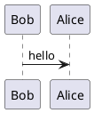

You can include text before 
and after the the image but the after has to come on its own line, the closing `)`
has to be the only non-blank on its line so that the URL content is not constrained.
If you need to include a single `)` inside the content, just indent it by an extra 4
spaces and it will be ignored as a terminating `)` of URL content.

https://www.plantuml.com/plantuml/uml/SoWkIImgoKqioU1AqoZHjDL8Z3VGr3TIq5OeBisDryYpDTICoyzFZCzBpY_MqCWho2pHrFVHr4QML4YApujHACxCGyXpEQJcfO0D1G00

http://www.plantuml.com/plantuml/proxy?cache=no&src=https://raw.github.com/plantuml/plan...

